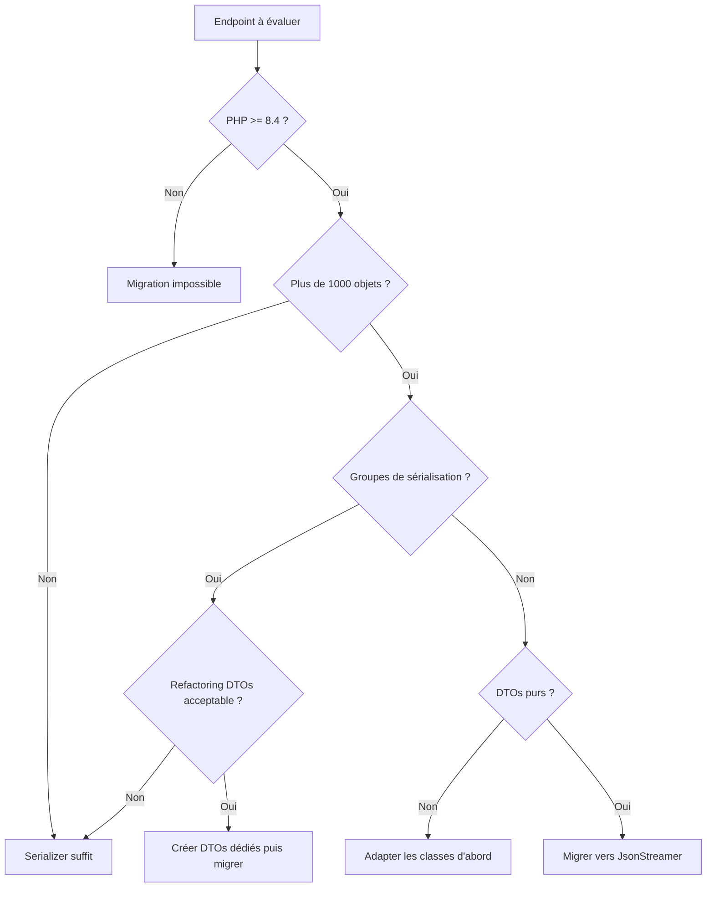

JsonStreamer sérialise jusqu'à 6x plus vite. Voilà pourquoi tu ne peux pas juste remplacer ton Serializer demain.

Le nouveau composant `symfony/json-streamer`, introduit dans Symfony 7.3 comme composant **expérimental**, promet des gains massifs sur la sérialisation JSON. Mais entre un benchmark sur un DTO simple et ton application Symfony en production avec ses groupes de normalisation, ses callbacks custom et ses objets imbriqués sur trois niveaux, il y a un gouffre.

Un point important : le composant est marqué expérimental par Symfony. Son API peut changer entre deux versions mineures sans garantie de rétrocompatibilité. C'est à prendre en compte avant de l'utiliser en production.

Cet article répond à trois questions : est-ce que mon projet est éligible ? Qu'est-ce que je vais perdre ? Par où commencer ?

## Ce que JsonStreamer change vraiment

Le Serializer Symfony fonctionne par réflexion. À chaque appel, il inspecte l'objet, résout les métadonnées, applique les normalizers dans l'ordre, construit un tableau PHP intermédiaire, puis l'encode en JSON. Tout est en mémoire, tout est dynamique, tout est flexible.

JsonStreamer prend l'approche inverse. Au moment du build (ou au premier appel), il génère du code PHP natif spécialisé pour chaque classe. Ce code produit du JSON directement, sans tableau intermédiaire, via un générateur PHP. C'est la différence entre imprimer un livre entier avant de l'envoyer, et l'envoyer page par page au fur et à mesure de l'impression. Le destinataire commence à recevoir alors que l'impression n'est pas terminée.

Les benchmarks officiels Symfony annoncent des gains jusqu'à 10x en temps et 98% en mémoire. On a voulu vérifier. Voici notre protocole : un DTO simple (`ProductDto`, cinq propriétés scalaires et une date), sérialisé en JSON sur des collections de 1 000 à 50 000 objets, dans un conteneur Docker `php:8.4-cli` vanilla.

| Objets | Serializer (ms) | JsonStreamer (ms) | Gain temps | Serializer (MB) | JsonStreamer (MB) | Gain mémoire |
|--------|-----------------|-------------------|------------|-----------------|-------------------|--------------|
| 1 000 | 17 | 7 | 2.5x | < 1 | < 1 | - |
| 10 000 | 63 | 15 | 4x | 4 | < 1 | > 75% |
| 50 000 | 342 | 54 | 6.3x | 24 | 8 | 67% |

*Mesures sur PHP 8.4.8, conteneur Docker `php:8.4-cli` sur Windows 11 (WSL2), moyenne de deux runs.*

Les chiffres sont en dessous des 10x annoncés, mais le gain reste significatif et augmente avec le volume. Sur 50 000 objets, le Serializer met 6 fois plus de temps et consomme 3 fois plus de mémoire. Sur des collections plus larges ou des objets plus complexes, l'écart se creuse encore.

Le script de benchmark complet est disponible ci-dessous pour reproduire ces mesures sur votre propre machine :

```php
<?php

require __DIR__ . '/vendor/autoload.php';

use Symfony\Component\Serializer\Serializer;
use Symfony\Component\Serializer\Encoder\JsonEncoder;
use Symfony\Component\Serializer\Normalizer\ObjectNormalizer;
use Symfony\Component\JsonStreamer\JsonStreamWriter;
use Symfony\Component\JsonStreamer\Attribute\JsonStreamable;
use Symfony\Component\TypeInfo\Type;

#[JsonStreamable]
class ProductDto
{
    public int $id;
    public string $name;
    public float $price;
    public string $category;
    public string $createdAt;
}

function generateProducts(int $count): array
{
    $products = [];
    for ($i = 0; $i < $count; $i++) {
        $dto = new ProductDto();
        $dto->id = $i;
        $dto->name = "Produit $i";
        $dto->price = round(mt_rand(100, 99999) / 100, 2);
        $dto->category = ['PHP', 'Symfony', 'DevOps', 'Cloud'][$i % 4];
        $dto->createdAt = '2026-01-' . str_pad(($i % 28) + 1, 2, '0', STR_PAD_LEFT);
        $products[] = $dto;
    }
    return $products;
}

foreach ([1_000, 10_000, 50_000] as $count) {
    $products = generateProducts($count);

    $serializer = new Serializer([new ObjectNormalizer()], [new JsonEncoder()]);
    memory_reset_peak_usage();
    $start = hrtime(true);
    $serializer->serialize($products, 'json');
    $serMs = round((hrtime(true) - $start) / 1_000_000, 1);
    $serMb = round(memory_get_peak_usage(true) / 1024 / 1024, 1);

    $streamer = JsonStreamWriter::create(streamWritersDir: '/tmp/cache');
    memory_reset_peak_usage();
    $start = hrtime(true);
    foreach ($streamer->write($products, Type::list(Type::object(ProductDto::class))) as $chunk) {}
    $strMs = round((hrtime(true) - $start) / 1_000_000, 1);
    $strMb = round(memory_get_peak_usage(true) / 1024 / 1024, 1);

    echo "$count objets : Serializer {$serMs}ms / {$serMb}MB, ";
    echo "JsonStreamer {$strMs}ms / {$strMb}MB\n";
}
```

Pour le lancer sous Linux/macOS :

```bash
docker run --rm -v $(pwd):/app -w /app php:8.4-cli \
  bash -c "apt-get update -qq > /dev/null && apt-get install -y -qq unzip git > /dev/null \
  && curl -sS https://getcomposer.org/installer | php -- --quiet \
  && php composer.phar require symfony/serializer symfony/json-streamer symfony/property-access symfony/property-info \
  && php bench.php"
```

Sous Windows (Git Bash / PowerShell) :

```bash
docker run --rm -v "%cd%:/app" -w /app php:8.4-cli bash -c "apt-get update -qq > /dev/null && apt-get install -y -qq unzip git > /dev/null && curl -sS https://getcomposer.org/installer | php -- --quiet && php composer.phar require symfony/serializer symfony/json-streamer symfony/property-access symfony/property-info && php bench.php"
```

## Les prérequis : la checklist avant de commencer

### PHP 8.4 obligatoire

Le composant requiert PHP 8.4 minimum (`"php": ">=8.4"` dans son `composer.json`). Pas de contournement possible.

```bash
php -v | head -1
```

Si la sortie affiche PHP 8.2 ou 8.3 : stop. Rien d'autre à lire ici, planifie d'abord ta montée de version PHP. Notre article sur [PHP 9.0 et les changements à anticiper](/article/php-9-0-devoile-ce-que-vous-devez-savoir-avant-la-sortie) peut t'aider à planifier cette trajectoire. Si tu es en 8.4+, on continue.

### Audit de tes objets sérialisés

JsonStreamer n'accepte que des classes à propriétés publiques, sans logique dans le constructeur. Un DTO pur, typiquement. Le script suivant analyse ton répertoire `src/` et identifie les classes compatibles :

```php
<?php

$directory = new RecursiveDirectoryIterator('src/');
$iterator = new RecursiveIteratorIterator($directory);
$phpFiles = new RegexIterator($iterator, '/\.php$/');

foreach ($phpFiles as $file) {
    $content = file_get_contents($file->getPathname());
    if (!preg_match('/class\s+(\w+)/', $content, $matches)) {
        continue;
    }

    $className = $matches[1];
    $issues = [];

    if (preg_match('/function\s+__construct\s*\([^)]+\)/', $content)) {
        $issues[] = 'constructeur avec arguments';
    }

    if (preg_match_all('/\b(private|protected)\s+\$/', $content, $propMatches)) {
        $issues[] = count($propMatches[0]) . ' propriétés non publiques';
    }

    $status = empty($issues) ? 'COMPATIBLE' : 'INCOMPATIBLE';
    $reason = empty($issues) ? '' : ' (' . implode(', ', $issues) . ')';

    echo sprintf("[%s] %s%s\n", $status, $className, $reason);
}
```

Sur un projet Symfony typique, ne sois pas surpris si 70% de tes classes sont incompatibles. C'est normal, les entités Doctrine, les services, les value objects avec constructeur sont tous exclus. Seuls tes DTOs purs sont candidats. Note que les changements introduits par [Doctrine ORM 3.0](/article/doctrine-orm-3-0-une-nouvelle-version-majeure-pour-les-bases-de-donnees) peuvent influencer la structure de tes entités dans ce contexte.

### Inventaire des fonctionnalités Serializer utilisées

Avant de migrer un endpoint, vérifie quelles fonctionnalités du Serializer il utilise. Voici la matrice de compatibilité :

| Fonctionnalité Serializer | Compatible JsonStreamer ? |
|---------------------------|--------------------------|
| Groupes de normalisation (`groups`) | Non |
| `#[SerializedName]` | Oui, équivalent disponible |
| Contexte dynamique | Non |
| Callbacks custom | Via ValueTransformer |
| Objets imbriqués | Oui |
| Collections | Oui |
| DateTime | Via ValueTransformer |
| Circular reference handler | Non applicable (pas de référence circulaire en DTO) |

Si ton endpoint utilise des groupes ou du contexte dynamique, la migration demande du refactoring structurel, pas juste un changement d'appel. Un outil comme [Rector](/article/rector-et-ses-pouvoirs-maitrisez-levolution-de-votre-code-symfony) peut automatiser une partie de ces transformations.

## Ce que tu perds, soyons honnêtes

### Les groupes de sérialisation

C'est la perte la plus douloureuse. Si tu as un `User` avec `["groups" => ["public"]]` pour l'API publique et `["groups" => ["admin"]]` pour le back-office, tu dois créer deux DTOs distincts : `PublicUserDto` et `AdminUserDto`.

```php
// Avant : un seul objet, deux vues
$json = $serializer->serialize($user, 'json', ['groups' => ['public']]);

// Après : un DTO par vue
$dto = PublicUserDto::fromEntity($user);
$json = $jsonStreamer->serialize($dto);
```

C'est plus verbeux, mais architecturalement plus propre. Chaque représentation est explicite dans le code, pas cachée dans une annotation. Si tu travailles en architecture hexagonale, tu as probablement déjà ces DTOs : la [migration vers l'architecture hexagonale](/article/migration-symfony-architecture-hexagonale-retour-mission) est précisément le contexte où cette séparation émergera naturellement.

### Le contexte dynamique

Fini le `$context['datetime_format'] = 'Y-m-d'` à la volée. Tout doit être configuré statiquement via des `ValueTransformer`. Pour des formats de dates qui varient selon l'appelant (API mobile vs API web, par exemple), c'est un problème. La solution : un DTO par format, ou un ValueTransformer configurable via un service.

### La compatibilité avec JMS Serializer

Si tu utilises JMS Serializer en plus du Serializer natif Symfony, JsonStreamer ne s'y substitue pas. Les deux ciblent des usages différents. JMS reste pertinent pour ses fonctionnalités avancées (versionning, exclusion strategies, virtual properties).

## La stratégie de migration

Pas de big bang. Les deux composants coexistent sans problème dans la même application Symfony. La migration se fait endpoint par endpoint, en commençant par les cas les plus simples et les plus impactants en performance.

### La règle de décision en 3 questions

Avant de migrer un endpoint, pose-toi ces trois questions dans l'ordre :

1. **Mon endpoint retourne plus de 1 000 objets ?** Si non, le gain de performance est négligeable, garde le Serializer.
2. **J'utilise des groupes de sérialisation sur cet endpoint ?** Si oui, tu devras refactorer tes DTOs avant de migrer, évalue le coût.
3. **Mes objets sont des DTOs purs (pas de constructeur avec arguments, propriétés publiques) ?** Si oui, JsonStreamer est viable immédiatement.



### Coexistence dans le même projet

Les deux composants s'injectent indépendamment grâce au [conteneur de services Symfony](https://symfony.com/doc/current/service_container.html). Tu peux utiliser le Serializer sur 90% de tes endpoints et JsonStreamer sur les 10% qui en ont besoin :

```yaml
# config/services.yaml
services:
    _defaults:
        autowire: true
        autoconfigure: true
```

Aucune configuration spéciale n'est nécessaire. Symfony 7.3 enregistre automatiquement le service `JsonStreamWriter` quand le composant est installé. Les deux coexistent nativement.

## La migration pas à pas sur un endpoint concret

### Avant, avec le Serializer

Un contrôleur classique qui expose une collection de produits :

```php
#[Route('/api/products', methods: ['GET'])]
public function list(
    ProductRepository $repository,
    SerializerInterface $serializer,
): JsonResponse {
    $products = $repository->findAll();

    return new JsonResponse(
        $serializer->serialize($products, 'json', [
            'groups' => ['api:product:list'],
        ]),
        json: true,
    );
}
```

Ce contrôleur charge tous les produits en mémoire, les sérialise en un seul bloc JSON, puis renvoie la réponse. Sur 50 000 produits, c'est 24 MB de RAM et plus de 340 ms d'attente.

### Après, avec JsonStreamer

D'abord, le DTO compatible :

```php
namespace App\Dto;

use Symfony\Component\JsonStreamer\Attribute\JsonStreamable;

#[JsonStreamable]
class ProductDto
{
    public int $id;
    public string $name;
    public float $price;
    public string $category;
    public string $createdAt;

    public static function fromEntity(Product $product): self
    {
        $dto = new self();
        $dto->id = $product->getId();
        $dto->name = $product->getName();
        $dto->price = $product->getPrice();
        $dto->category = $product->getCategory()->getName();
        $dto->createdAt = $product->getCreatedAt()->format('Y-m-d');

        return $dto;
    }
}
```

Ensuite, le contrôleur migré :

```php
use Symfony\Component\HttpFoundation\StreamedResponse;
use Symfony\Component\JsonStreamer\JsonStreamWriter;
use Symfony\Component\TypeInfo\Type;

#[Route('/api/products', methods: ['GET'])]
public function list(
    ProductRepository $repository,
    JsonStreamWriter $streamWriter,
): StreamedResponse {
    $products = $repository->findAll();
    $dtos = array_map(ProductDto::fromEntity(...), $products);

    $json = $streamWriter->write($dtos, Type::list(Type::object(ProductDto::class)));

    return new StreamedResponse($json);
}
```

La différence fondamentale : le JSON est envoyé au client par morceaux. Le navigateur (ou le client API) commence à recevoir les données pendant que le serveur continue à les produire. Le pic mémoire reste stable quelle que soit la taille de la collection.

Sur 50 000 produits, on passe de ~340 ms à ~54 ms et de ~24 MB à ~8 MB.

## Pour aller plus loin

- [API REST : les bonnes pratiques](/article/api-rest-les-bonnes-pratiques), structurer vos endpoints avant de les optimiser
- [Quelle architecture choisir entre micro-service ou monolithe modulaire](/article/quelle-architecture-de-projet-choisir-entre-micro-service-ou-monolithe-modulaire), le contexte architectural qui influence le choix Serializer vs JsonStreamer
- [Pourquoi Docker est indispensable en production aujourd'hui](/article/pourquoi-docker-est-indispensable-en-production-aujourdhui), containeriser pour maîtriser les versions PHP
- [Tout savoir sur la mise en cache](/article/tout-savoir-sur-la-mise-en-cache-tips), compléter la performance JSON avec une stratégie de cache adaptée
- [Swagger et NelmioApiDocBundle](/article/swagger-nelmio-bundle-et-ses-fonctionnalites-pourquoi-lutilise-t-on), documenter vos endpoints sérialisés
- [Streaming JSON : documentation Symfony](https://symfony.com/doc/current/serializer/streaming_json.html), la référence officielle

JsonStreamer n'est pas le futur du Serializer, c'est un outil spécialisé pour un problème précis. Si tu fais du volume, il est imbattable. Si tu as besoin de flexibilité de vue avec des groupes et du contexte dynamique, garde le Serializer. Les deux coexistent, utilise-les ensemble. La migration intelligente, c'est endpoint par endpoint, en commençant par ceux où le gain est mesurable. Ce type d'optimisation ciblée fait partie des leviers que nous activons dans nos projets de [développement web sur mesure](/developpement-web-sur-mesure).
